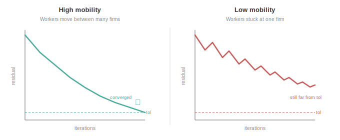
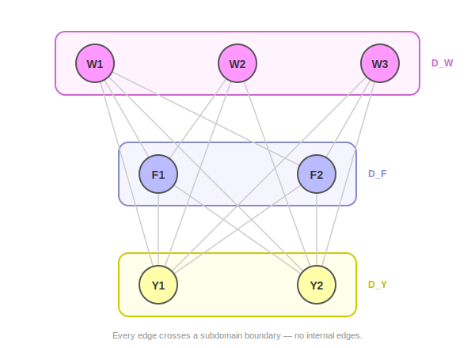
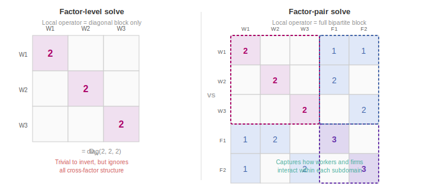
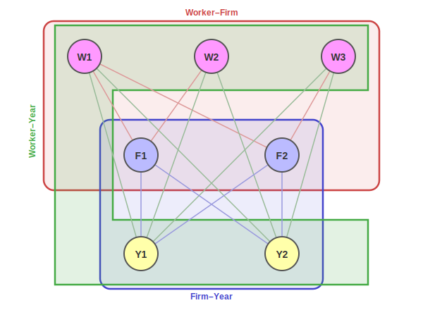

# Part 1: Fixed Effects and Block Iterative Methods

This is Part 1 of the algorithm documentation for the `within` solver. It introduces the fixed-effects estimation problem, derives the normal equations and their block structure, describes the classical demeaning algorithm and its limitations, and motivates the domain decomposition approach in [Part 2](2_solver_architecture.md).

**Series overview**:
- **Part 1: Fixed Effects and Block Iterative Methods** (this document)
- [Part 2: Preconditioned LSMR and Schwarz Decomposition](2_solver_architecture.md)
- [Part 3: Local Solvers and Approximate Cholesky](3_local_solvers.md)

---

## Notation

| Symbol | Meaning |
|--------|---------|
| $n$ | Number of observations |
| $Q$ | Number of factors (fixed-effect grouping variables) |
| $m_q$ | Number of levels (categories) in factor $q$ |
| $m = \sum_q m_q$ | Total degrees of freedom / total number of factor levels over all fixed effects|
| $D$ | Design matrix ($n \times m$), with exactly $Q$ ones per row |
| $W$ | Diagonal weight matrix ($n \times n$), $W = \text{diag}(w_1, \dots, w_n)$ |
| $G$ | Gramian matrix, $G = D^\top W D$ ($m \times m$) |
| $y$ | Response vector ($n \times 1$) |
| $\alpha$ | Fixed-effects coefficient vector ($m \times 1$) |
| $D_q$ | Diagonal block of $G$ for factor $q$ (weighted level counts) |
| $C_{qr}$ | Cross-tabulation block of $G$ for factor pair $(q, r)$ |

---

## 1. The Fixed-Effects Model

A panel dataset records $n$ observations, each classified by $Q$ categorical factors that econometricians commonly refer to as "fixed effects". Factor $q$ has $m_q$ distinct levels. The linear fixed-effects model is:

$$
y_i = \sum_{q=1}^{Q} \alpha_{q, f_q(i)} + \varepsilon_i, \qquad i = 1, \dots, n
$$

where $f_q(i) \in \{1, \dots, m_q\}$ is the level of factor $q$ for observation $i$ and $\alpha_{q,j}$ is the coefficient for level $j$ of factor $q$.

In matrix form, we could write this as

$$
y = D\alpha + \varepsilon
$$

where $D$ is the sparse $n \times m$ design matrix of 0s and 1s. Each row of $D$ has exactly $Q$ ones, one in each factor's column block.

---

## 2. Weighted Normal Equations

To fit $\alpha$, we minimize the weighted least-squares objective             
                                                                              
$$\hat{\alpha} = \arg\min_\alpha \sum_{i=1}^{n} w_i \left( y_i -
\sum_{q=1}^{Q} \alpha_{q,f_q(i)} \right)^2
$$

where $W = \text{diag}(w_1, \dots, w_n)$ is a diagonal weight matrix (the
unweighted case corresponds to $W = I$). Setting the gradient to zero yields
the weighted normal equations:

$$
G\alpha = D^\top W y, \qquad G = D^\top W D
$$

The Gramian $G$ is symmetric positive semi-definite and always singular: within each connected component of the factor interaction graph, a constant can be shifted between factors without changing $D\alpha$. The system is always consistent, and the solver (starting from zero) converges to the minimum-norm solution.

---

## 3. Block Structure of the Gramian

### 3.1 Factor-block partition

The $m \times m$ Gramian inherits a natural block structure from the factor partition. With columns ordered by factor ($m_1$ columns for factor 1, then $m_2$ for factor 2, etc.):

```math
G = \begin{pmatrix}
{\color{#4169E1}D_1} & C_{12} & C_{13} & \cdots & C_{1Q} \\
C_{12}^\top & {\color{#DC143C}D_2} & C_{23} & \cdots & C_{2Q} \\
C_{13}^\top & C_{23}^\top & {\color{#228B22}D_3} & \cdots & C_{3Q} \\
\vdots & \vdots & \vdots & \ddots & \vdots \\
C_{1Q}^\top & C_{2Q}^\top & C_{3Q}^\top & \cdots & {\color{#DAA520}D_Q}
\end{pmatrix}
```

The blocks are:

- **Diagonal blocks** $D_q$ ($m_q \times m_q$, diagonal): $D_q[j,j] = \sum_{i:\, f_q(i) = j} w_i$ - the weighted count of observations at level $j$ of factor $q$.

- **Cross-tabulation blocks** $C_{qr}$ ($m_q \times m_r$, sparse): $C_{qr}[j,k] = \sum_{i:\, f_q(i) = j,\; f_r(i) = k} w_i$ - the weighted count of observations simultaneously at level $j$ of factor $q$ and level $k$ of factor $r$.

There are $Q$ diagonal blocks and $\binom{Q}{2}$ cross-tabulation blocks.

### 3.2 A concrete example

Consider a worker-firm data set (often referred to as AKM-style panel) with $n = 6$ observations and $Q = 3$ factors (worker id's, firm id's, and years). Worker W1 moves from Firm F1 to F2. This mobility is what connects the two firms in the estimation graph. Workers 2 (F1) and 3 (F2) are only observed in a single firm. 

| Obs | Worker ($f_1$) | Firm ($f_2$) | Year ($f_3$) | Weight | $y$ |
|-----|---------|------|------|--------|------|
| 1 | W1 | F1 | Y1 | 1 | 3.2 |
| 2 | W1 | F2 | Y2 | 1 | 4.1 |
| 3 | W2 | F1 | Y1 | 1 | 2.8 |
| 4 | W2 | F1 | Y2 | 1 | 3.9 |
| 5 | W3 | F2 | Y1 | 1 | 5.0 |
| 6 | W3 | F2 | Y2 | 1 | 4.5 |

Factor 1 (the worker fixed effect) has $m_1 = 3$ levels: {W1, W2, W3}. Factor 2 (the firm fixed effect) has $m_2 = 2$ levels: {F1, F2}. Last, Factor 3 (Year) has $m_3 = 2$ levels: {Y1, Y2}. In total, we have $m = 7$ fixed effects levels over all factors.

The Gramian has $Q = 3$ diagonal blocks and $\binom{3}{2} = 3$ cross-tabulation blocks:

```math
G = \begin{pmatrix}
{\color{#4169E1}D_W} & {\color{gray}C_{WF}} & {\color{gray}C_{WY}} \\
{\color{gray}C_{WF}^\top} & {\color{#DC143C}D_F} & {\color{gray}C_{FY}} \\
{\color{gray}C_{WY}^\top} & {\color{gray}C_{FY}^\top} & {\color{#228B22}D_Y}
\end{pmatrix} = \begin{pmatrix}
{\color{#4169E1}2} & {\color{#4169E1}0} & {\color{#4169E1}0} & 1 & 1 & 1 & 1 \\
{\color{#4169E1}0} & {\color{#4169E1}2} & {\color{#4169E1}0} & 2 & 0 & 1 & 1 \\
{\color{#4169E1}0} & {\color{#4169E1}0} & {\color{#4169E1}2} & 0 & 2 & 1 & 1 \\
1 & 2 & 0 & {\color{#DC143C}3} & {\color{#DC143C}0} & 2 & 1 \\
1 & 0 & 2 & {\color{#DC143C}0} & {\color{#DC143C}3} & 1 & 2 \\
1 & 1 & 1 & 2 & 1 & {\color{#228B22}3} & {\color{#228B22}0} \\
1 & 1 & 1 & 1 & 2 & {\color{#228B22}0} & {\color{#228B22}3}
\end{pmatrix}
```

$D_W$ is $3 \times 3$ (one row/column per worker) with 2s on the diagonal because each worker appears in exactly 2 observations (e.g. W1 in obs 1, 2). Off-diagonals are zero because no observation belongs to two workers. $D_F$ is $2 \times 2$ with 3s on the diagonal because each firm appears in 3 observations (F1 in obs 1, 3, 4; F2 in obs 2, 5, 6). The cross-tabulation block $C_{WY}$ is $3 \times 2$ (3 workers $\times$ 2 years); entry $[j,k]$ counts observations where worker $j$ is observed in year $k$. Here every worker appears once per year, so $C_{WY}$ is all ones.

The Gramian's sparsity pattern defines an interaction graph on all $m = 7$ factor levels. Each node is a factor level, and each nonzero entry $C_{qr}[j,k]$ in a cross-tabulation block becomes an edge between level $j$ of factor $q$ and level $k$ of factor $r$. For example, $C_{WF}[\text{W1},\text{F1}] = 1$ (W1 is observed once at F1) creates the W1–F1 edge, while $C_{WF}[\text{W2},\text{F1}] = 2$ (W2 is observed twice at F1) creates the W2–F1 edge with weight 2:


No edges connect degrees of freedom (factor levels) within the same factor. As edges only cross factor boundaries, we say that the graph is $Q$-partite. Each factor-pair subgraph is bipartite. The diagonal entries reflect the same structure: $D_Y[\text{Y1},\text{Y1}] = 3$ because Y1 is connected to 3 other nodes, one for each observation in year Y1 (obs 1, 3, 5). The graph is connected because W1's mobility between F1 and F2 bridges the two firms; without it, the graph would split into disconnected components.

### 3.3 Key properties of the Fixed Effects Problem

We note two properties of the Gramian $G$ that drive the algorithmic design of solvers for the fixed effects problem:

> 1. **The diagonal blocks $D_q$ are diagonal matrices**, which are trivially invertible. This makes the classical demeaning algorithm (Section 4) cheap per iteration.
>
> 2. **The cross-tabulation blocks $C_{qr}$ are typically sparse** - an entry is nonzero only when at least one observation has that specific (level-of-$q$, level-of-$r$) combination.

---

## 4. The Classical Solution: Iterative Demeaning

### 4.1 The Demeaning Algorithm / MAP Algorithm

The classical approach to solving the normal equations for fixed effects regression goes back to Guimarães & Portugal (2010) and Gaure, 2013. The algorithm sweeps through factors one at a time, updating each factor's coefficients while holding the others fixed. Guimaraes and Portugal called this the "Zig-Zag", but the method is commonly know as the "method of alternating projections" or MAP algorithm. 

More concretely, for factor $q$, each coefficient is set to the weighted average of the factor-$q$ partial residual at that level (for observation $i$, this is $y_i$ minus all fitted effects except factor $q$):

$$
\alpha_{q,j} \leftarrow \frac{\sum_{i:\, f_q(i)=j} w_i\, (y_i - \sum_{r \neq q} \alpha_{r,f_r(i)})}{\sum_{i:\, f_q(i)=j} w_i}
$$

This is **demeaning by factor $q$**: for each level $j$, compute the weighted average of $y_i - \sum_{r \neq q} \alpha_{r,f_r(i)}$ across all observations $i$ with $f_q(i) = j$, and set $\alpha_{q,j}$ to that average.

One full sweep updates all $Q$ factors in order - the MAP algorithm is identical to block Gauss-Seidel on the normal equations. Note that each factor update only involves the diagonal block $D_q$; the cross-tabulation blocks $C_{qr}$ are never used.

### 4.2 Solving a Worker-Firm-Year Regression via the MAP Algorithm

Continuing the Worker/Firm/Year example, one full sweep processes $Q = 3$ factors in order:

**Step 1** In step 1, we update the worker coefficients, holding coefficients for firm and year fixed. Each worker's coefficient becomes the weighted average of $(y_i - \text{firm effect} - \text{year effect})$ for observations at that worker.

**Step 2** We then update the coefficients for firms, using the **updated** worker values from step 1, but **stale** year values. Each firm's coefficient becomes the weighted average of $(y_i - \text{worker effect} - \text{year effect})$, but the year effects are still from the previous iteration.

**Step 3** Finally, we update the year effects, using updated worker and updated firm values.

This process is repeated until convergence. 

Only the last factor in a given sweep - years - sees fully updated values from all other factors. Workers were updated with stale firm and year effects; firms were updated with stale year effects. When factors are correlated (e.g. high-skill workers sort into high-paying firms), the correct worker effect depends on the firm effect and vice versa: updating workers with a stale firm estimate means the worker coefficients won't land in the right place, and the subsequent firm update has to compensate - partially undoing the worker correction. With $Q = 3$, two out of three updates use out-of-date information. As $Q$ grows, the problem worsens: more of each sweep is spent on corrections that the remaining updates will undo, and the method needs more sweeps to converge (see Section 4.4).

### 4.3 Convergence rate

How many more sweeps? For two factors, the error contracts by $\cos^2(\theta_F)$ per sweep, where $\theta_F$ is the Friedrichs angle between the factor subspaces:



The convergence rate is determined by the structure of the cross-tabulation matrix $C_{WF}$. Consider two labor markets, both with 6 workers and 2 firms:

**High mobility labour market** - Every worker is observed at both firms:

$$
C_{WF} = \begin{pmatrix} 1 & 1 \\ 1 & 1 \\ 1 & 1 \\ 1 & 1 \\ 1 & 1 \\ 1 & 1 \end{pmatrix}
$$

Every row has weight at both firms. If W1 has a high $y_i$ at F1 *and* a high $y_i$ at F2, that's evidence for a high worker effect of W1; if only the F1 observations are high, that's evidence for a high firm effect, and it is relatively straightforward to disentangle the two. The factor subspaces are nearly orthogonal, $\cos(\theta_F)$ is small, and convergence is fast.

**Low mobility labour market** - There is only one mover (W1), the rest are stayers:

$$
C_{WF} = \begin{pmatrix} 1 & 1 \\ 2 & 0 \\ 2 & 0 \\ 0 & 2 \\ 0 & 2 \\ 0 & 2 \end{pmatrix}
$$

The matrix is nearly block-diagonal. W2 and W3 are only observed at F1; W4–W6 only at F2. For these stayers, every observation of the worker is also an observation of their firm - the effects are confounded. The only information separating the two firms comes through W1, the single mover. The subspaces are nearly collinear, $\cos(\theta_F) \approx 1$, and the algorithm makes little progress per sweep - the information separating workers from firms lives in $C_{WF}$, which the algorithm never touches. In the limit where there are no movers at all, $C_{WF}$ becomes exactly block-diagonal, the system splits into disconnected components, and $\cos(\theta_F) = 1$.

For more than two fixed effects ($Q > 2$), any near-collinear pair bottlenecks the entire iteration.

### 4.4 Limitations of the MAP Algorithm

Based on the exposition above, there are three structural limitiations of the MAP algorithm: 

1. **The local solve can't be improved** - each factor update already solves $D_q$ exactly (it's diagonal), so there's nothing to gain within a single factor. The only way to make progress is to do more sweeps.

2. **The cross-factor structure is ignored** - the algorithm only ever touches the diagonal blocks $D_q$ of the Gramian, which makes each sweep cheap but means it's entirely oblivious to the cross-tabulation blocks $C_{qr}$ that couple the factors.

3. **Degradation with more factors** - for more than two fixed effects with $Q > 2$, each factor's update uses stale values from factors not yet processed in the current sweep. The effective convergence rate worsens as the number of interacting pairs grows.

All three motivate the algorithm used in `within`. 

---

## 5. The Domain Decomposition Perspective

### 5.1 Demeaning as a domain decomposition method

As we saw in Section 4, the MAP algorithm sweeps through one factor at a time, solving the diagonal block $D_q$ at each step. In domain decomposition terminology, this is a **multiplicative Schwarz** method with $Q$ non-overlapping subdomains, one per factor:



This is essentially the same interaction graph from Section 3.2, now grouped into factor-level subdomains. Every edge crosses a subdomain boundary - the local operators $D_q$ are trivially diagonal, with no internal edges. The local solves are trivial but they capture **none** of the cross-factor coupling.

### 5.2 The key idea: factor-pair subdomains

`within` uses a fundamentally different decomposition: subdomains are **factor pairs**, not individual factors.

For each pair $(q, r)$, the subdomain contains all levels from both factors. The local operator is the full bipartite block:

$$
A_{qr} = \begin{pmatrix} D_q & C_{qr} \\ C_{qr}^\top & D_r \end{pmatrix}
$$

This captures the complete interaction between the two factors — the diagonal counts **and** the cross-tabulation. In practical applications, these bipartite systems are often too large to solve exactly, but their structure — a bipartite graph that can be transformed into a graph Laplacian — admits nearly-linear-time approximate solvers (Schur complement reduction + approximate Cholesky, see [Part 3](3_local_solvers.md)). 

The figure below illustrates the difference between what MAP algorithm and `within` algo "see". The MAP algo is only aware of the diagonal blocks $D_q$, which are cheap to invert, but ignores all cross-factor coupling - the off-diagonal blocks $C_{qr}$. `within`'s domain decomposition solver instead incorporates the cross-factor structure into each local solve, at the cost of solving a larger, coupled system per subdomain. This is the central tradeoff: via the MAP algorithm, we get cheaper iterations that ignore part of the structure of the problem vs. more expensive iterations that exploit structure it via `within` algorithm.



| Property | Factor-level (demeaning) | Factor-pair (`within`) |
|---|---|---|
| Local solve | **Exact** (diagonal inversion) | **Approximate** (sampled Cholesky) |
| Coupling captured | None - ignores $C_{qr}$ entirely | Full pairwise interaction |
| Number of subdomains | $Q$ | $\leq \binom{Q}{2} \times$ (components) |
| Overlap | None | Yes - each factor level appears in $Q - 1$ pairs |

Demeaning solves each factor *exactly* but learns nothing about cross-factor structure. Factor-pair subdomains solve each pair *approximately* but capture the coupling that makes convergence slow in the first place. As a result, the approximate pair-solves carry much more information per iteration, and fewer outer iterations are needed until convergence.

### 5.3 Continuing the Worker-Firm Example

The Worker/Firm/Year example ($Q = 3$) produces $\binom{3}{2} = 3$ factor-pair subdomains:

| Subdomain | Factor pair | Factor Levels | Size |
|-----------|-------------|------|------|
| 1 | (Worker, Firm) | W1, W2, W3, F1, F2 | 5 |
| 2 | (Worker, Year) | W1, W2, W3, Y1, Y2 | 5 |
| 3 | (Firm, Year) | F1, F2, Y1, Y2 | 4 |

Each factor level appears in $Q - 1 = 2$ subdomains, requiring partition-of-unity weights to prevent double-counting (see [Part 2, Section 4.2](2_solver_architecture.md#42-partition-of-unity)).

To illustrate the process, we draw the same interaction graph from the beginning of this section, but now with three overlapping factor-pair subdomains drawn around it:



The Worker–Firm subdomain (red) covers the top two rows. The Firm–Year subdomain (blue) covers the bottom two. The Worker–Year subdomain (green) wraps around the Firms in a C-shape. Every edge is now *inside* a subdomain. Each node sits in exactly 2 of the 3 boxes, which is why partition-of-unity weights are needed.

### 5.4 Where this leads

The factor-pair decomposition raises three algorithmic questions:

1. **How can we solve the local systems efficiently?** Here the answer is to use an approximate Cholesky factorization with Schur complement reduction ([Part 3](3_local_solvers.md))
2. **How can we combine the local corrections?** Via additive Schwarz with partition-of-unity weights ([Part 2](2_solver_architecture.md))
3. **How can we drive the global iteration?** → Preconditioned modified LSMR ([Part 2](2_solver_architecture.md))

---

## References

**Correia, S.** (2016). *A Feasible Estimator for Linear Models with Multi-Way Fixed Effects*. Working paper. Describes the fixed-effects normal equations, their block structure, and iterative solution via alternating projections.

**Xu, J.** (1992). *Iterative Methods by Space Decomposition and Subspace Correction*. SIAM Review, 34(4), 581–613. Provides the abstract space decomposition framework for additive and multiplicative Schwarz methods.

**Toselli, A. & Widlund, O. B.** (2005). *Domain Decomposition Methods - Algorithms and Theory*. Springer. Comprehensive reference for the theory and convergence analysis of Schwarz methods.
