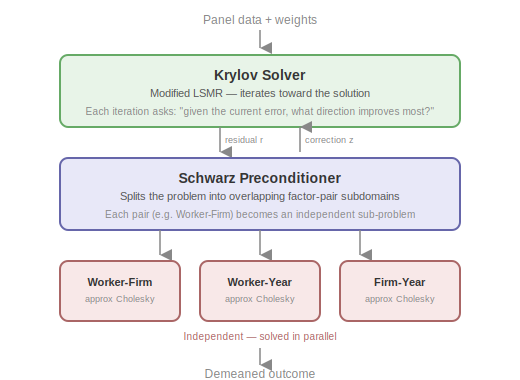
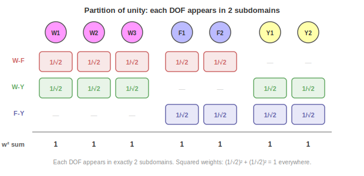

# Part 2: Preconditioned LSMR and Schwarz Decomposition

This is Part 2 of the algorithm documentation for the `within` solver. It describes the three-layer solver architecture, the graph structure that drives the domain decomposition, the modified LSMR outer iteration, and the additive Schwarz preconditioner framework.

**Series overview**:
- [Part 1: Fixed Effects and Block Iterative Methods](1_fixed_effects_and_block_methods.md)
- **Part 2: Preconditioned LSMR and Schwarz Decomposition** (this document)
- [Part 3: Local Solvers and Approximate Cholesky](3_local_solvers.md)

**Prerequisites**: Part 1 (problem formulation, Gramian block structure, demeaning as multiplicative Schwarz at the factor level).

---

## 1. Three-Layer Architecture

The solver combines three algorithmic ideas in a layered architecture:

1. **Modified LSMR** — a Krylov-subspace least-squares solver — iterates on the rectangular operator $A = \sqrt{W} D$ with right-hand side $b = \sqrt{W} y$, using the preconditioner to accelerate convergence.

2. An **additive Schwarz preconditioner** decomposes the global system into overlapping subdomains derived from the Gramian's block structure, applies local solves independently to each, and combines the corrections using partition-of-unity weights.

3. **Local solvers**. Each subdomain system is a bipartite Gramian block that becomes a graph Laplacian after a sign-flip, factored in nearly-linear time using approximate Cholesky (see [Part 3](3_local_solvers.md)).

### Why this combination

As discussed in [Part 1, Section 5.2](1_fixed_effects_and_block_methods.md#52-the-key-idea-factor-pair-subdomains), the central trade-off for solving the fixed effects problem is between **exact solves on single factors** (demeaning via the MAP algorithm) vs. **approximate solves on factor pairs** (`within`). The three layers exist to make this trade-off pay off:

- **Block-bipartite structure**: each factor pair $(q,r)$ induces a bipartite subgraph. Connected components of these subgraphs form natural subdomains with limited overlap.

- **Laplacian connection**: after a sign-flip transformation (Section 2.3), each bipartite block becomes a graph Laplacian. This unlocks nearly-linear-time *approximate* solvers — exact factorization would be too expensive for large subdomains, but the approximate Cholesky factorization ([Part 3](3_local_solvers.md)) produces factors that are accurate enough to make the outer LSMR iteration converge in very few steps.

- **Spectral acceleration**: the LSMR outer iteration compensates for the approximate nature of the local solves. Even though each preconditioner application is inexact, LSMR refines the solution globally. The preconditioner clusters the singular values of $A M^{-1/2}$ (equivalently, the eigenvalues of $M^{-1} A^\top A$), reducing the iteration count from $O(\sqrt{\kappa(A)})$ (unpreconditioned) to a count determined by the quality of the local solves rather than the global condition number.

---

## 2. Graph Structure of the Gramian

Part 1 derived the block structure of $G = D^\top W D$, with diagonal blocks $D_q$ and cross-tabulation blocks $C_{qr}$. It is convenient to write $`G = \mathcal{D} + \mathcal{C}`$, where $`\mathcal{D} = \text{block-diag}(D_1, \ldots, D_Q)`$ collects the diagonal blocks and $`\mathcal{C}`$ collects the off-diagonal cross-tabulation blocks. This section describes the graph-theoretic properties that drive the domain decomposition.

### 2.1 Factor-pair bipartite blocks

Each cross-tabulation block $C_{qr}$ defines a weighted bipartite graph: the left vertices are the $m_q$ levels of factor $q$, the right vertices are the $m_r$ levels of factor $r$, and the edge weight between $j$ and $k$ is $C_{qr}[j,k]$ (nonzero when at least one observation has $f_q = j$ and $f_r = k$).

The full factor-pair block is:

$$
G_{qr} = \begin{pmatrix} D_q & C_{qr} \\ C_{qr}^\top & D_r \end{pmatrix}
$$

### 2.2 Connected components as subdomains

The bipartite graph of $C_{qr}$ may have multiple connected components. Each connected component defines an independent subproblem and becomes a subdomain of the Schwarz preconditioner.

| Full interaction graph | Worker–Firm subgraph |
|:---:|:---:|
|  |  |

Continuing the Worker/Firm/Year example from [Part 1](1_fixed_effects_and_block_methods.md): extracting just the Worker–Firm edges (right) gives the bipartite graph of $C_{WF}$. Because W1 worked at both firms, the graph is connected — there is a path between any two nodes — so all 5 DOFs / factor levels belong to a single subdomain. Without W1's mobility, the graph would split into two components: {W1, W2, F1} and {W3, F2}, yielding two independent subdomains.

### 2.3 Laplacian connection via sign-flip and Laplacian Solver

The bipartite block $G_{qr}$ has non-negative off-diagonal entries, so it is not directly a graph Laplacian. Negating the off-diagonal blocks produces one:

$$
L_{qr} = \begin{pmatrix} D_q & -C_{qr} \\ -C_{qr}^\top & D_r \end{pmatrix}
$$

This is a valid graph Laplacian: $L_{qr}$ is symmetric, has non-positive off-diagonal entries, and zero row sums. The zero row-sum property holds because every observation at level $j$ of factor $q$ has exactly one level in factor $r$, so $D_q[j,j] = \sum_k C_{qr}[j,k]$.

Equivalently, $G_{qr} = S^\top L_{qr} S$ where $S = \mathrm{diag}(I, -I)$. Since $S$ is orthogonal ($S^{-1} = S^\top$), solving $G_{qr} x = b$ — the subproblem we started out with — via the Laplacian is straightforward: negate one block of $b$ by multiplying with $S$, solve $L_{qr} z = \tilde{b}$, then negate the same block of $z$ by multiplying with $S$ again. This Laplacian structure is exploited by the local solvers described in [Part 3](3_local_solvers.md).

---

## 3. Modified LSMR Outer Iteration

The outer solver iteratively solves the least-squares problem

$$
\min_{\alpha} \; \|\sqrt{W}(y - D\alpha)\|_2^2,
$$

whose normal equations are $G\alpha = D^\top W y$. `within` runs **modified LSMR** on the rectangular operator $A = \sqrt{W} D$ with right-hand side $b = \sqrt{W} y$.

### 3.1 Gramian-shaped preconditioner

Even though LSMR iterates on the rectangular $A$, the preconditioner $M^{-1}$ approximates the **Gramian** $A^\top A = G$ — it is an $m \times m$ operator, not $n \times n$. The Schwarz preconditioner described in [Section 4](#4-additive-schwarz-domain-decomposition) is exactly such an operator: its subdomains are blocks of $G$, and the local-solver work in [Part 3](3_local_solvers.md) operates on those Gramian blocks.

### 3.2 Modified Golub–Kahan bidiagonalization

Each LSMR iteration extends a Krylov subspace via a short bidiagonalization recurrence on $A$. The **Modified Golub–Kahan** variant carries a scaled intermediate vector $\tilde{p}$ between steps so that exactly one $M^{-1}$ application is needed per iteration. The per-iteration cost is:

- one $A v$ (apply $\sqrt{W} D$ — a single sparse-matrix product),
- one $A^\top u$ (apply $D^\top \sqrt{W}$),
- one $M^{-1} \tilde{p}$ (one Schwarz preconditioner application — see [Section 4](#4-additive-schwarz-domain-decomposition)),
- a constant number of `axpy`-style vector updates.

### 3.3 Optional windowed reorthogonalization

LSMR's short recurrence relies on the bidiagonalization vectors being mutually orthogonal. In floating-point arithmetic this orthogonality erodes for ill-conditioned $A$, and convergence stalls before the residual reaches the tolerance. Optional **windowed modified Gram–Schmidt** reorthogonalization against the last $N$ basis vectors restores orthogonality at cost proportional to $N$; a window of 5–20 is cheap insurance for difficult problems.

### 3.4 Convergence criterion

The solver converges when the relative residual on the normal equations satisfies $\|A^\top r_k\|_2 \leq \text{tol} \cdot \|A^\top b\|_2$, where $r_k = b - A\alpha_k$. LSMR computes this quantity cheaply from the bidiagonalization scalars rather than forming $A^\top r_k$ explicitly. A small residual implies $\alpha_k$ is close to the true solution $\alpha^\ast$ and hence that the demeaned residuals $e = y - D\alpha_k$ are accurate.

---

## 4. Additive Schwarz Domain Decomposition

[Part 1, Section 5](1_fixed_effects_and_block_methods.md#5-the-domain-decomposition-perspective) introduced the Schwarz perspective and contrasted factor-level with factor-pair decompositions. This section provides the full algorithmic details for the additive variant used in `within`.

### 4.1 How it works

The Schwarz preconditioner decomposes the global Gramian into overlapping subdomains — one per factor-pair connected component — and applies local solves to each. The local operator on subdomain $i$ is $A_i = R_i G R_i^\top$, the principal submatrix of $G$ restricted to that subdomain's DOFs / factor levels, where $R_i$ is the restriction matrix that picks out subdomain $i$'s rows.

### 4.2 Partition of unity

When subdomains overlap (a DOF / factor level belongs to multiple subdomains), corrections must be weighted to avoid double-counting:

Each DOF / factor level $j$ that appears in $c_j$ subdomains gets weight $\omega_j = 1/\sqrt{c_j}$ in each subdomain. The weights are applied on both the restriction and prolongation sides, so they contribute $c_j \times \omega_j^2 = 1$ — correctly partitioning the correction. In the running example, every DOF / factor level appears in exactly 2 subdomains, so every weight is $\omega_j = 1/\sqrt{2}$.

### 4.3 The additive Schwarz operator

The additive Schwarz preconditioner applies all local solves independently and sums the weighted corrections:

$$
M^{-1} r = \sum_{i=1}^{N_s} R_i^\top \tilde{D}_i A_i^+ \tilde{D}_i R_i \, r
$$

where $\tilde{D}_i = \mathrm{diag}(\omega_j)_{j \in \text{subdomain } i}$ is the diagonal of partition-of-unity weights for subdomain $i$, and $A_i^+$ denotes the (approximate) inverse provided by the local solver from [Part 3](3_local_solvers.md).

Each subdomain restricts the global residual to its local DOFs / factor levels (with partition-of-unity weights applied on input), solves the local system, and prolongates the correction back to the global space (with weights applied on output). All subdomains are processed independently and in parallel. Because the weighting is applied symmetrically on both sides, the resulting preconditioner is symmetric positive definite — the property LSMR requires of $M$.

### 4.4 Subdomain construction

Subdomains are derived from the factor-pair structure of the Gramian:

1. **Enumerate factor pairs**: all $\binom{Q}{2}$ unordered pairs $(q, r)$.
2. **Build cross-tabulation**: for each pair, scan observations to build the sparse bipartite block $C_{qr}$ and diagonal vectors $D_q$, $D_r$.
3. **Find connected components**: run DFS (depth-first search — a standard graph traversal that follows edges recursively until no new nodes are reachable) on the bipartite graph of $C_{qr}$ to identify independent components.
4. **Create subdomains**: each component becomes a subdomain with its global DOF / factor level indices.
5. **Compute partition-of-unity weights**: if subdomains overlap, count how many subdomains each DOF / factor level belongs to and assign $\omega_j = 1/\sqrt{c_j}$; for non-overlapping DOFs / factor levels the weight is trivially 1.

Factor pairs are processed in parallel.

---

## 5. Full Algorithm Summary

We conclude with a summary of the full algorithm.

### 5.1 Setup phase

1. **Build weighted design** from `categories` and `weights`.
   - Infer $m_q$ (number of levels) per factor by scanning observations.

2. **For each factor pair $(q, r)$ in parallel:**
   - Build cross-tabulation $C_{qr}$ and diagonal blocks $D_q$, $D_r$.
   - Find connected components of the bipartite graph of $C_{qr}$.
   - Create one subdomain per component, recording its global DOF / factor level indices.

3. **Compute partition-of-unity weights**: $\omega_j = 1/\sqrt{c_j}$ for each DOF / factor level $j$.

4. **For each subdomain in parallel:**
   - Build local Laplacian via sign-flip (Section 2.3).
   - Factor with approximate Cholesky (or dense Cholesky for small systems; see Part 3).

5. **Assemble** Schwarz preconditioner $M^{-1}$ from subdomain factors.

### 5.2 Solve phase

1. **Form the rectangular operator and right-hand side**: $A = \sqrt{W} D$, $b = \sqrt{W} y$ (both implicit — never materialized).

2. **Run modified LSMR** on $(A, b)$ with preconditioner $M^{-1}$:
   - Each iteration: one $Av$, one $A^\top u$, one $M^{-1}\tilde{p}$ application, plus a constant number of vector updates.
   - Optionally reorthogonalize against the last `local_size` basis vectors.
   - Converge when $\|A^\top r_k\|_2 \leq \text{tol} \cdot \|A^\top b\|_2$.

3. **Compute demeaned residuals**: $e = y - D\alpha$.

4. **Report** the final relative residual along with the converged solution $\alpha$.

---

## References

**Correia, S.** (2016). *A Feasible Estimator for Linear Models with Multi-Way Fixed Effects*. Working paper. Describes the fixed-effects normal equations and their block structure.

**Fong, D. C.-L. & Saunders, M. A.** (2011). *LSMR: An Iterative Algorithm for Sparse Least-Squares Problems*. SIAM Journal on Scientific Computing, 33(5), 2950–2971. Original LSMR algorithm and convergence analysis.

**Xu, J.** (1992). *Iterative Methods by Space Decomposition and Subspace Correction*. SIAM Review, 34(4), 581–613. Provides the abstract space decomposition framework for additive Schwarz methods.

**Toselli, A. & Widlund, O. B.** (2005). *Domain Decomposition Methods — Algorithms and Theory*. Springer. Comprehensive reference for the theory and convergence analysis of Schwarz domain decomposition methods.
