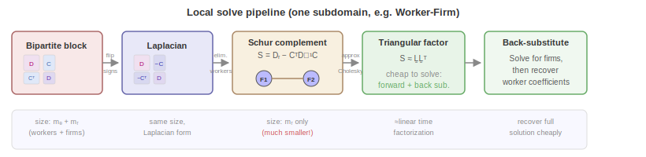
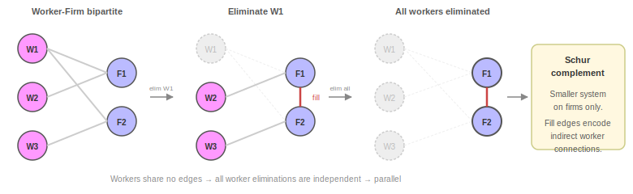
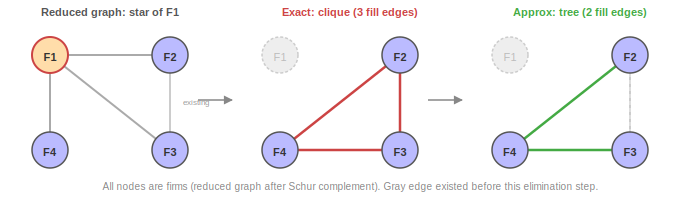
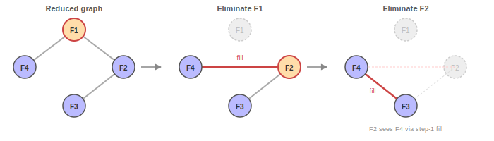

# Part 3: Local Solvers and Approximate Cholesky

This is Part 3 of the algorithm documentation for the `within` solver. It describes how each Schwarz subdomain is solved: the Schur complement reduction that shrinks the problem, and the approximate Cholesky factorization that solves it in nearly-linear time.

**Series overview**:
- [Part 1: Fixed Effects and Block Iterative Methods](1_fixed_effects_and_block_methods.md)
- [Part 2: Preconditioned LSMR and Schwarz Decomposition](2_solver_architecture.md)
- **Part 3: Local Solvers and Approximate Cholesky** (this document)

**Prerequisites**: Part 1 (Gramian block structure), Part 2 (Schwarz framework, Laplacian connection).

---

## 1. The Local Solve Pipeline

Each subdomain requires solving a system $A_i z_i = r_i$ where $A_i$ is the bipartite Gramian block for a factor pair. These systems are too large to solve exactly in practice - a Worker-Firm block in a real dataset may have millions of DOFs / factor levels. Instead, the solver produces an **approximate** factorization that is cheap to build and cheap to apply, trading exactness for speed. The LSMR outer iteration ([Part 2](2_solver_architecture.md)) compensates for this approximation by refining the global solution across iterations.

The local solve applies a pipeline of transformations that progressively simplify the problem:

The key stages are:

0. We start by forming a **Bipartite block** of a factor pair.
1. We then **sign-flip** the bipartite block into a graph Laplacian (zero row-sums)
2. Next we **eliminate the larger factor** via Schur complement - which reduces e.g. a (workers + firms) system to a firms-only system. This step can be exact or approximate (Section 3.3).
3. We **factor** the reduced system with approximate Cholesky - the main source of approximation
4. Last, we **solve** via cheap triangular substitution, then back-substitute to recover the full solution

The approximation enters in steps 2 (optionally) and 3 (always): both use **clique-tree sampling** to avoid the quadratic fill that exact Gaussian elimination would produce.

---

## 2. Laplacian Connection

The local operator for a factor pair is:

$$
A_i = G_{\text{local}} = \begin{pmatrix} D_q & C \\ C^\top & D_r \end{pmatrix}
$$

Negating the off-diagonal blocks produces a graph Laplacian:

$$
L = \begin{pmatrix} D_q & -C \\ -C^\top & D_r \end{pmatrix}
$$

This works because every observation at level $j$ of factor $q$ has exactly one level in factor $r$, so $D_q[j,j] = \sum_k C[j,k]$ - the row sums are exactly zero.

The local solve wrapper handles the sign convention: negate the second block of the RHS before solving, negate the second block of the solution after. Downstream transformations (approximate Schur complement, approximate Cholesky) may introduce small row-sum deficits; when this happens, **Gremban augmentation** adds one extra "ground" node connected to all others, absorbing the deficit and restoring a valid Laplacian.

---

## 3. Schur Complement Reduction

Since workers share no edges in the bipartite graph, we can **eliminate all workers at once** to get a smaller system on firms only.

### 3.1 What elimination looks like on the graph

Each worker elimination removes that worker and creates **fill edges** between the firms they worked at. Worker W1 worked at F1 and F2, so eliminating W1 creates a direct F1–F2 connection. These fill edges encode indirect connections mediated through workers.

Since workers have no edges between themselves (the graph is bipartite), all worker eliminations are independent and can proceed in parallel.

### 3.2 The reduced system

Given the Laplacian:

$$
\begin{pmatrix} D_q & -C \\ -C^\top & D_r \end{pmatrix}
\begin{pmatrix} z_q \\ z_r \end{pmatrix}
= \begin{pmatrix} b_q \\ b_r \end{pmatrix}
$$

Eliminate the larger block (say workers, $D_q$). Since $D_q$ is diagonal, this is exact and cheap:

$$
S\, z_r = b_r + C^\top D_q^{-1} b_q
$$

where the **Schur complement** is:

$$
S = D_r - C^\top D_q^{-1} C
$$

The Schur complement $S$ is a Laplacian on the smaller factor's levels (e.g. firms), with edge weights that capture indirect connections through the eliminated factor (e.g. workers). After solving for $z_r$, back-substitution recovers $z_q = D_q^{-1}(b_q + C\, z_r)$.

### 3.3 Exact vs. approximate elimination

Each eliminated worker with $d$ firm connections creates a dense **clique** of $\binom{d}{2}$ fill edges among its firms. A worker who worked at 100 firms creates $\binom{100}{2} = 4{,}950$ fill edges - this can be expensive.

The **approximate** variant (Gao, Kyng, and Spielman, 2025) replaces each clique with a random **spanning tree** with only $d - 1$ edges instead of $\binom{d}{2}$. The tree weights are chosen so that the expected Laplacian matches the clique Laplacian (i.e. is an **unbiased estimator**).  

For a worker observed at 100 firms, this reduces the fill from 4,950 edges to just 99 - a 50× reduction - without introducing bias, since the tree weights are chosen so that the approximate Schur complement is unbiased.

---

## 4. Approximate Cholesky Factorization

The approximate Cholesky algorithm (Gao, Kyng, and Spielman, 2025) factors the Schur complement $S$ into an approximate lower-triangular factor $\tilde{L}$ such that $\tilde{L}\tilde{L}^\top \approx S$. It is the same core idea as the Schur complement step, but applied sequentially to a general (non-bipartite) graph.

### 4.1 How it works

The algorithm eliminates vertices one by one in random order. Each elimination produces fill edges (a clique on the vertex's neighbors). Instead of materializing all $O(d^2)$ clique edges, it samples a random spanning tree with only $d - 1$ edges - the same clique-tree trick used in Section 3.3:

The difference from the Schur complement step is that here, eliminations are **sequential** - each one modifies the graph for the next:

Eliminating F1 creates a fill edge F2–F4. When F2 is eliminated next, it now connects to F4 (via the fill from step 1), producing further fill F3–F4. This cascading fill is why the Schur complement reduction - which exploits the bipartite independence - is performed first, and approximate Cholesky is applied only to the smaller reduced system.

### 4.2 Properties

The key property is that $\mathbb{E}[\tilde{L}\tilde{L}^\top] = S$ (unbiased). The resulting triangular factor is cheap to apply: the local solve becomes a forward substitution followed by a back substitution, costing $O(m_{\text{local}})$ per application.

---

## References

**Gao, Y., Kyng, R., & Spielman, D. A.** (2025). *Robust and Practical Solution of Laplacian Equations by Approximate Gaussian Elimination*. arXiv:2303.00709. Primary reference for the approximate Cholesky factorization via clique-tree sampling (AC(k) algorithm), Schur complement approximation, and Gremban augmentation.

**Gremban, K. D.** (1996). *Combinatorial Preconditioners for Sparse, Symmetric, Diagonally Dominant Linear Systems*. PhD thesis, Carnegie Mellon University. SDDM-to-Laplacian augmentation technique.
